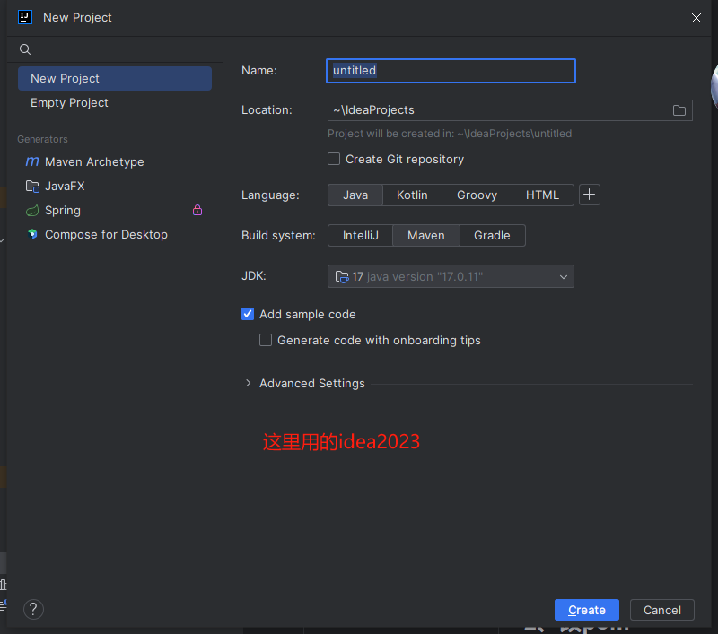
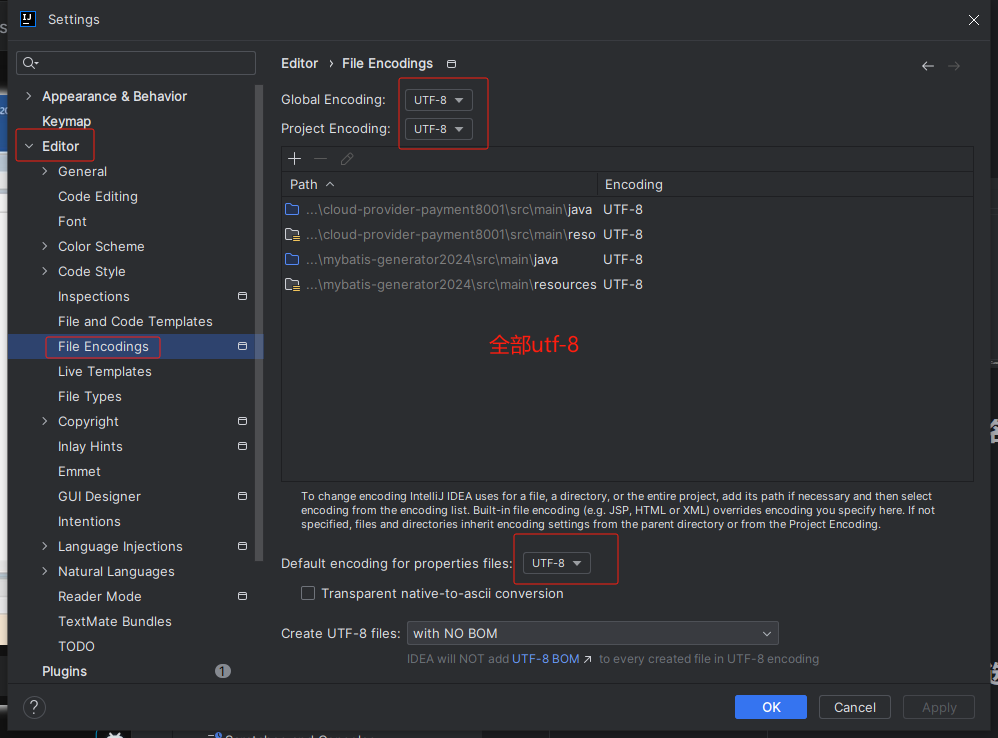
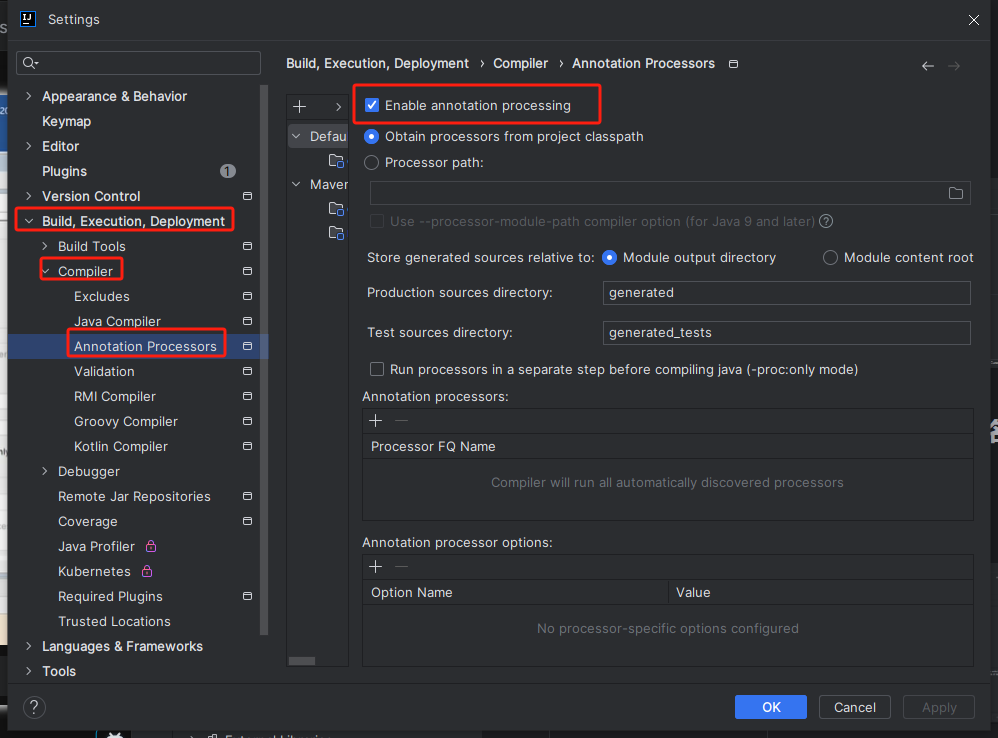
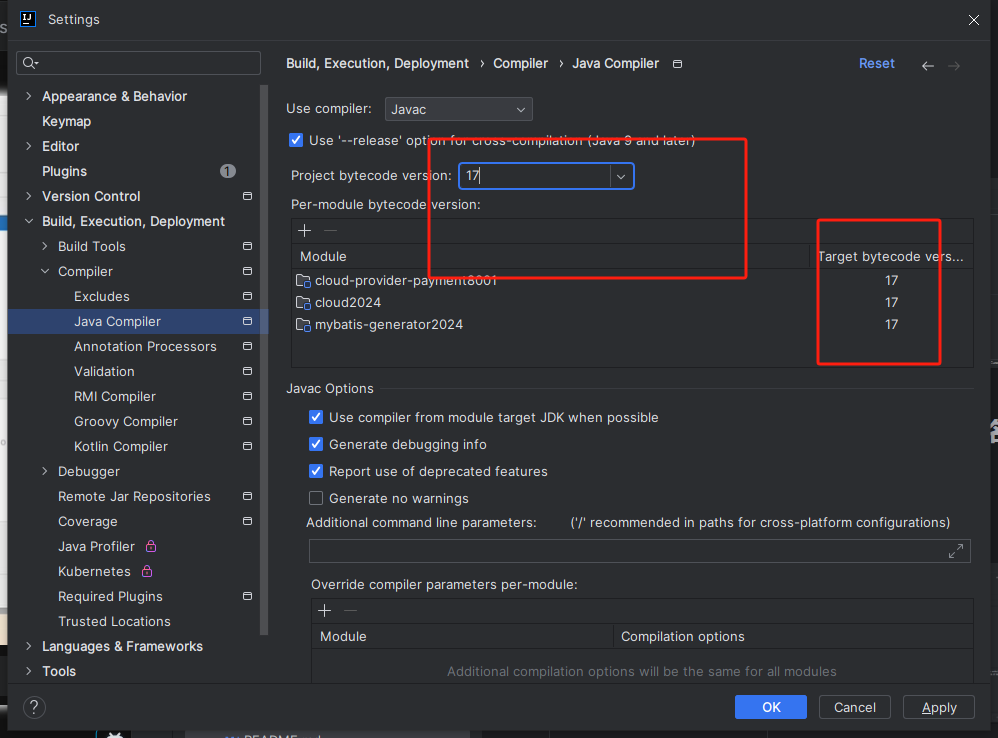
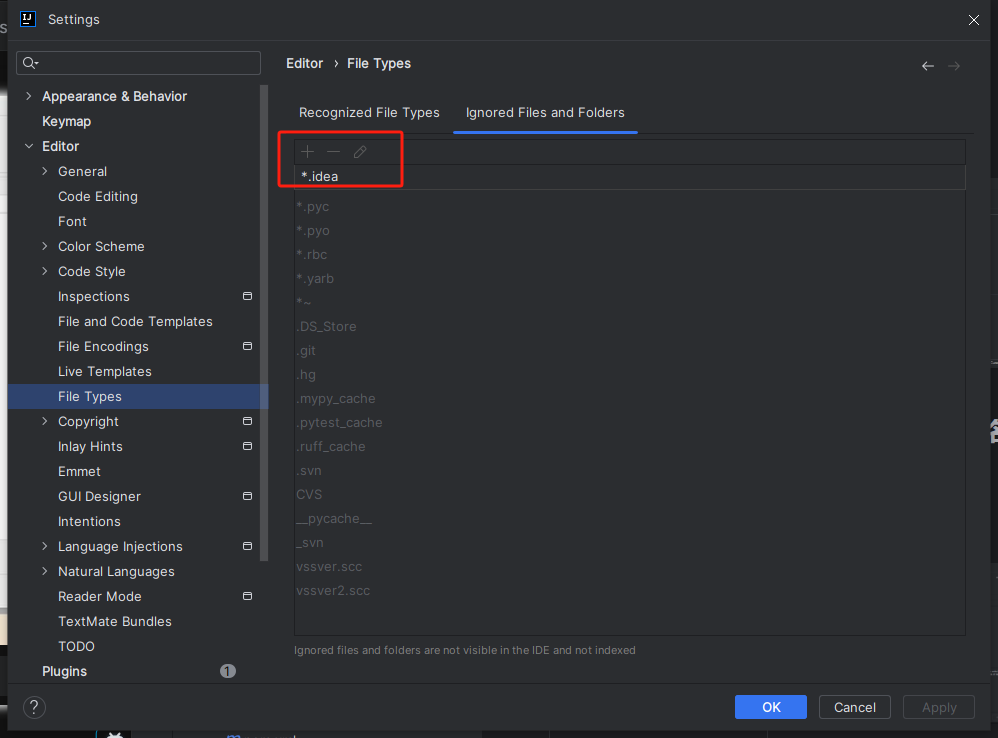

# Maven父工程步骤
## 1、New Project

## 2、聚合总父工程名字
## 3、字符编码

## 4、注解生效激活

## 5、java编译版本选17

## 6、File Type过滤

# 微服务小口诀
## 1、建module
## 2、改pom
## 3、写yaml
## 4、主启动类
## 5、业务类
### 5.1、将之前一键生成的代码直接拷贝进8001模块
### 5.2、model
### 5.3、mapper
### 5.4、service
### 5.5、controller